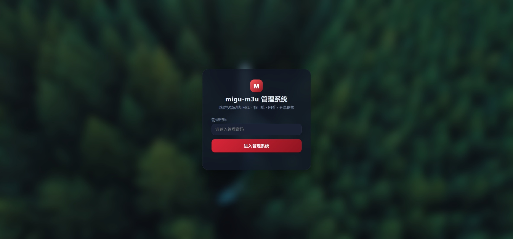
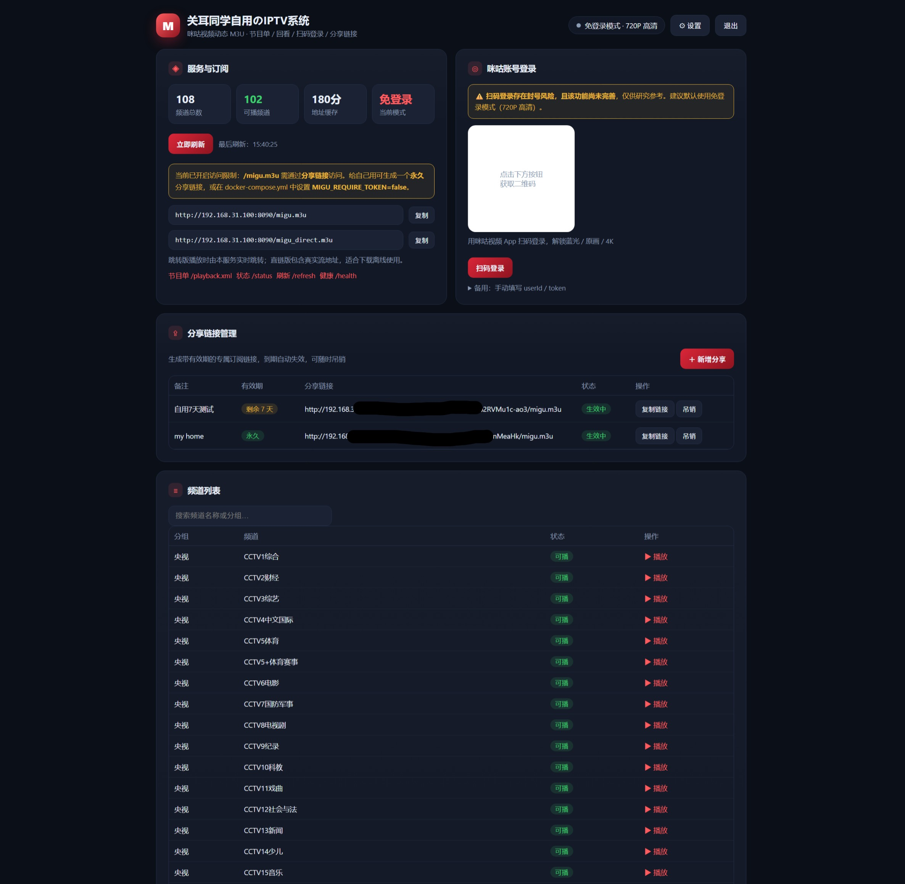
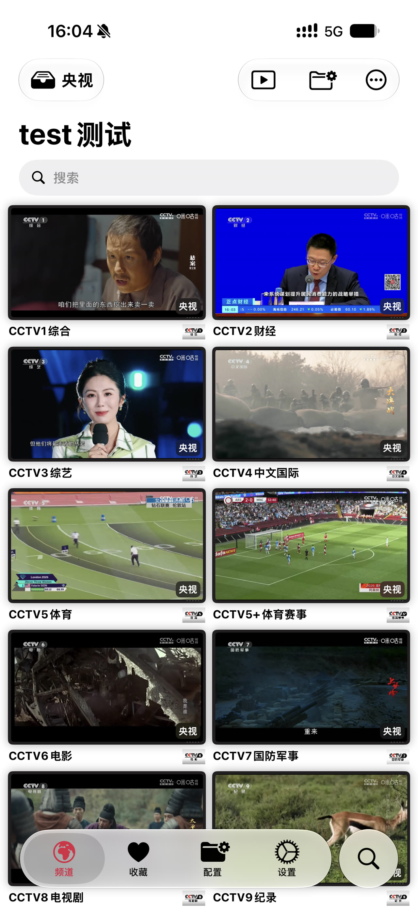
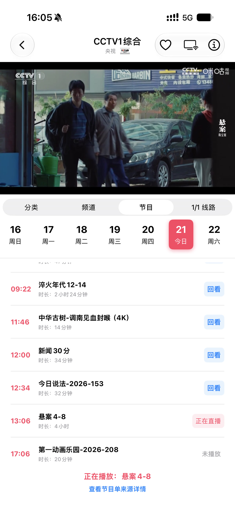
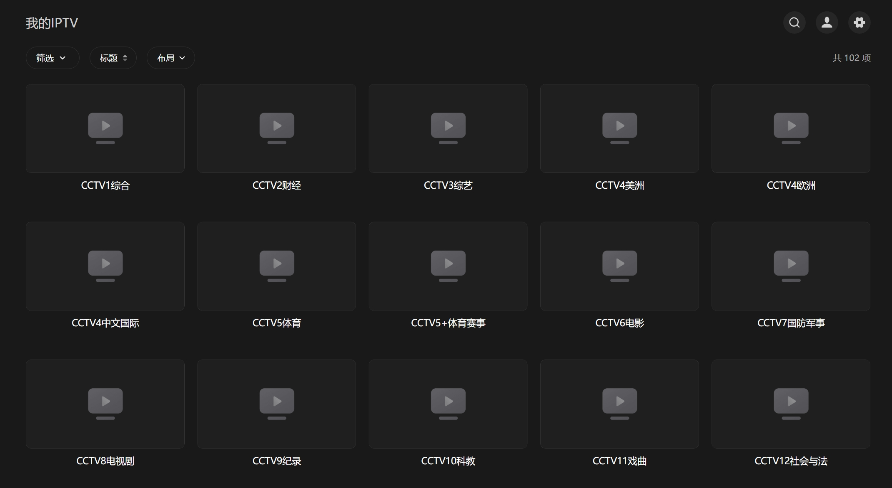
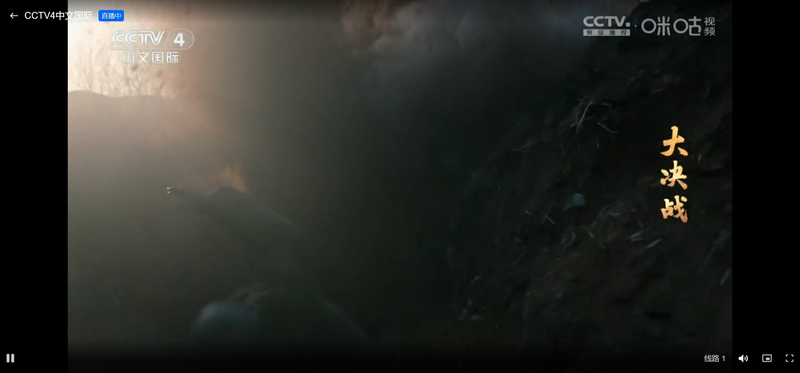

# migu-m3u 咪咕视频动态 M3U 直播服务

基于咪咕视频公开接口的免登录动态 M3U 服务：一套部署，手机、电视、电脑上任意支持 M3U 的播放器都能看央视、卫视和地方台直播，还能回看近 3 天节目。

> ⚠️ 本项目仅供个人学习研究使用，请勿用于商业用途。

## 功能亮点

**免登录 · 无封号风险**
默认免登录模式即可观看 720P 高清直播，不需要任何咪咕账号，也不存在账号被封的风险。

**央视全套**
央视 1–17 套、CGTN 中英法西俄阿等语种频道全覆盖，另有各大卫视、地方台、新闻、影视、教育、少儿、纪实等共 100+ 频道，频道列表自动同步咪咕官方接口。

**支持回看**
内置咪咕官方节目单（XMLTV 格式），支持回看近 3 天节目（更早内容为会员专属）；节目单加载快、中文节目名，随 M3U 自动加载。

**M3U 永不失效**
跳转版订阅地址由本服务实时解析跳转，播放地址定时自动刷新 + 缓存，列表永远有效，不会出现“地址过期放不出来”的情况。

**后台自动刷新**
频道列表、播放地址、节目单全部定时自动更新，无需人工干预；也可以在面板一键手动刷新。

**个性化定制**
自定义系统标题、登录页壁纸（自动高斯模糊 + 暗色蒙版）、画质与 H265 编码开关，打造属于你自己的直播系统。

**灵活分享管理**
面板一键生成带有效期的专属订阅链接（7 天 / 30 天 / 一年 / 永久），到期自动失效，可随时吊销；分享令牌持久化保存，升级与重构不丢失。

**可视化面板**
服务状态、频道列表、咪咕账号登录、分享管理、系统设置一体化的 Web 管理界面，独立管理密码保护。

**国内友好部署**
基础镜像走 DaoCloud 加速源，Python 依赖自动切换清华 / 阿里 / 腾讯源，国内环境开箱即用。

## 界面预览

> 截图位置已预留，待补充。

**后台管理界面**

**手机第三方 App 观看**

**PC 第三方软件观看**

## 快速部署

### 环境要求

一台 NAS 或 Linux 服务器，已安装 Docker（群晖 Container Manager、飞牛 Docker、或 docker CLI 均可）。

### 部署步骤

1. 把整个 `migu-m3u` 文件夹放到 NAS 的固定位置（例如 `/volume1/docker/migu-m3u`）；
2. 编辑 `docker-compose.yml`，**务必修改管理密码** `MIGU_ADMIN_PASSWORD`（默认 `admin`），按需调整其他环境变量；
3. 启动项目：
   - 群晖：Container Manager → 项目 → 新建 → 选择该文件夹 → 启动；
   - 飞牛：Docker → Compose → 粘贴 `docker-compose.yml` → 启动；
   - 命令行：`docker compose up -d --build`；
4. 浏览器打开 `http://<NAS-IP>:8090/`，输入管理密码进入面板；
5. 在“分享链接管理”里给自己生成一个**永久**分享链接，在 APTV、VLC 等支持 M3U 的播放器中订阅即可观看。

### 订阅与回看

- 订阅地址：`http://<NAS-IP>:8090/s/{token}/migu.m3u`（跳转版，推荐，地址永不失效）
- 节目单：`http://<NAS-IP>:8090/s/{token}/playback.xml`（随 M3U 自动加载）
- 回看：在支持回看的播放器（APTV、TiviMate 等）节目单中选择过去的时间点即可；免费回看近 3 天

> 默认开启了访问限制（`MIGU_REQUIRE_TOKEN=true`），`/migu.m3u` 需通过分享链接访问；局域网自用可改为 `false`。

## 更新与免丢失数据重构

所有持久化数据都保存在 `data/` 目录（容器外挂载，`./data:/data`），包括：

- `tokens.json`：分享令牌（有效期、吊销状态）
- `login.json`：咪咕登录信息
- `epg.json`：节目单缓存
- `channels.json`：频道列表缓存
- `panel_settings.json`：面板标题与壁纸设置
- `wallpaper`：登录页壁纸

**更新代码（推荐）**

只覆盖代码文件（`app/`、`Dockerfile`、`docker-compose.yml`、`README.md`、`requirements.txt`），保留 `data/` 不动，然后重建容器即可，分享链接、登录状态、面板设置全部保留。

**完整重构（删除项目重建）**

1. 先备份：把整个 `data/` 目录复制到其他位置（或改名 `data.bak`）；
2. 删除 / 重建项目文件夹，放入新代码；
3. 把备份的 `data/` 放回新目录（或把 `docker-compose.yml` 的挂载路径指向备份位置）；
4. 重新构建启动，分享链接原样有效。

**迁移到新 NAS**

把整个 `migu-m3u` 文件夹（含 `data/`）拷贝到新机器，执行 `docker compose up -d --build` 即可，所有配置与分享链接不变。

## 配置项

| 环境变量 | 默认值 | 说明 |
|---|---|---|
| `MIGU_ADMIN_PASSWORD` | `admin` | 面板管理密码（请修改） |
| `MIGU_REQUIRE_TOKEN` | `true` | 访问限制：开启后 `/migu.m3u`、`/playback.xml`、`/play` 必须用分享链接 |
| `MIGU_ALLOW_DIRECT` | `true` | 直链版是否开放（自用） |
| `MIGU_BASE_URL` | 自动识别 | 公网 / HTTPS 反代时手动指定访问地址 |
| `MIGU_CATEGORIES` | `央视,卫视,地方,新闻,影视,教育,综艺,少儿,纪实` | 频道分组，按需增删 |
| `MIGU_RATE_TYPE` | `3` | 免登录画质（3=高清 720P） |
| `MIGU_H265` | `false` | 是否请求 H265 原画 |
| `MIGU_REFRESH_MINUTES` | `60` | 播放地址自动刷新间隔 |
| `MIGU_URL_CACHE_MINUTES` | `180` | 单频道地址缓存时长 |
| `MIGU_EPG_BACK_DAYS` | `2` | 节目单往前覆盖天数 |
| `MIGU_EPG_FORWARD_DAYS` | `1` | 节目单往后覆盖天数 |
| `MIGU_EPG_REFRESH_HOURS` | `6` | 节目单刷新间隔 |
| `MIGU_TITLE` | `migu-m3u 管理面板` | 面板默认标题（可在设置中修改） |

## 常见问题

- **构建卡在拉取基础镜像**：已默认走 DaoCloud 加速源；也可在 Docker 设置里配置国内镜像加速。
- **pip 安装失败**：Dockerfile 已内置“清华 → 阿里 → 腾讯 → 官方”自动切换，若仍失败请检查 NAS 网络。
- **`/migu.m3u` 返回 403**：已开启访问限制，请使用分享链接；自用可设 `MIGU_REQUIRE_TOKEN=false`。
- **个别频道无法播放 / 没有回看**：部分频道版权要求登录或处于“节目播出调整”，属正常现象。
- **扫码登录说明**：扫码登录存在封号风险且未经作者完整验证，建议使用免登录模式（720P 高清）。

## 免责声明

本项目仅供个人学习研究，频道与流地址均来自咪咕官方接口；请勿用于商业用途，因使用本项目产生的一切后果由使用者自行承担。
